<!-- Banner SVG Animado -->

  

<h1 align="center">💻 Manuel Hau — Fullstack & Mobile Engineer</h1>

  <em>Mobile-First Engineer · React / Next.js · Node.js · SaaS Builder</em>

---

## 🚀 About Me

Soy un **Mobile-First Engineer** con +6 años de experiencia desarrollando aplicaciones modernas usando **React Native**, **React.js (Next.js 15)** y **Node.js/Express**.  
Actualmente estoy construyendo **Conciencia Web**, un ERP modular y multi-tenant para negocios de impresión y promocionales en México, integrando:

- 🧾 Cotizaciones avanzadas paso a paso (**Quote Wizard**)  
- 👥 Gestión de clientes, contactos, items y proveedores  
- 💸 Cálculo dinámico de precios según técnica, arranques y variantes  
- ☁️ Integración con **AWS S3**, **Firebase Auth** y **Mongoose/Prisma**  

---

## 🛠️ Tech Stack

**Frontend**  
⚡ React 19 · Next.js (App Router) · TailwindCSS 3.4 · Redux Toolkit · Formik + Yup · Radix UI · Framer Motion  

**Mobile**  
📱 React Native (Expo) · Firebase · Google Sign-In  

**Backend**  
🛠 Node.js · Express · Prisma ORM · Mongoose · JWT · AdminJS  

**Infra & Tools**  
☁️ AWS S3 · Docker · Vite · Chart.js · Sonner · Radix · Lucide Icons  

---

## 📂 Featured Projects

- 🔥 **Conciencia Web (ERP SaaS)** — Plataforma modular para cotizaciones y gestión de negocios de impresión.  
- 📡 **Giganexus Telecom** — Proyecto de redes FTTH con Mikrotik, VLANs y CCR2216.  
- ☕ **Rebels Coffee Club** — Landing page con promociones, subscripciones y estilo visual moderno.  
- 👕 **Revibe** — E-commerce de ropa personalizada con impresión DTF.  

---

## 🌍 Connect with Me  

  
  
  

---

## 🎨 Fun Facts  

- 🌴 Vivo en **Yucatán, México**  
- 🎨 Apasionado por la **UI/UX moderna** tipo dashboard con animaciones suaves  
- 🚀 Enfocado en crear **SaaS accesibles para pequeños negocios**  

---

## 📊 GitHub Stats  

  
  

  

---
